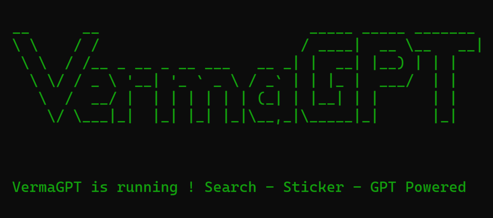

# V3rmaGPT
A GPT-powered WhatsApp bot built in Node.js capable of connecting WhatsApp with ChatGPT. Converting images to stickers and vice versa. Fetching results for your google search and so on.



## Getting Started
Install Node.js from their [Official Website](https://nodejs.org/en/download) and setup in your Device

### For Linux
Clone the official repository using this command (For Linux) 
```
https://github.com/54ndeepV3rma/v3rmaGPT/
```
### For Windows
Download the repository directly by clicking [here](https://github.com/54ndeepV3rma/v3rmaGPT/archive/refs/heads/main.zip)
and extract it once it is downloaded
### Working
Open the folder ```V3rmaGPT``` 
and Run this command
```
npm install
```
It'll take some time to get installed
After completion, Run this command inside the folder
```
npm install openai dotenv readline-sync
```

### Configure ChatGPT
Visit the website [OpenAI](https://platform.openai.com/account/api-keys) and login with your account.


Click on ```Create new secret key``` and copy the key generated by the website and save it.

Open the ```.env``` file in your code editor and paste the API Key here


Now save it and we're ready to go !!
Close all the terminals now

## Running 
Open new terminal inside the folder ```V3rmaGPT```

Run this command 
```
npm start
```
Once you run, It will generate a WhatsApp Web QR-Code for you 


Now open WhatsApp in your mobile device, and open WhatsApp web scanner to scan this QR Code


Now your WhatsApp is connected with ChatGPT! You can verify by sending message from another number


## Features 
  |                   Features                  	| Status 	|
  |:-------------------------------------------:	|:------:	|
  | ChatGPT Integration                          	|    ✅   	|
  | GPT Powered Conversation                     	|    ✅   	|
  | Google Dork Searcher                         	|    ✅   	|
  | Free eBook Searcher                          	|    ✅   	|
  | Image to Sticker                            	|    ✅   	|
  | Video to Sticker                            	|    ✅   	|
  | Gif to Sticker                              	|    ✅   	|
  | Sticker to Image                            	|    ✅   	|
  | Sticker to Video                            	|    ❎   	|

## Commands 
  <table class="tg">
    <thead>
      <tr>
        <th class="tg-0pky">Commands</th>
        <th class="tg-0pky">Description</th>
      </tr>
    </thead>
    <tbody>
      <tr>
        <td class="tg-0pky">!s</td>
        <td class="tg-0pky">Make Image/Video/Gif into Sticker. Write !s in the caption of Image/Video/GIF while sending it to bot</td>
      </tr>
      <tr>
        <td class="tg-0pky">!search</td>
        <td class="tg-0pky">Fetch Links using google dork. For E.g: !search inurl:php?id= site:com </td>
      </tr>
      <tr>
        <td class="tg-0pky">!book</td>
        <td class="tg-0pky">Search for eBooks in pdf. For E.g: !book Cybersecurity Basics /td>
      </tr>
    </tbody>
  </table>
